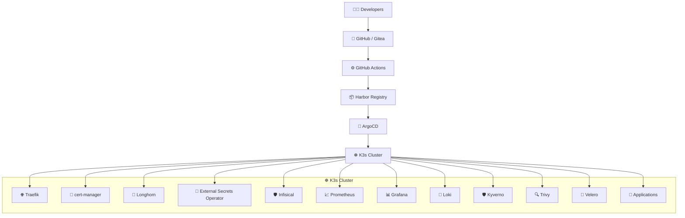

# 🚀 GitOps Platform Architecture

<p align="center">


</p>

---

## 🏗️ Architecture



---

# 🔄 GitOps Workflow

```text
        👨‍💻 Developers
              │
              ▼
      📂 GitHub / Gitea
              │
              ▼
     ⚙️ GitHub Actions
              │
              ▼
      📦 Harbor Registry
              │
              ▼
         🚀 ArgoCD
              │
              ▼
         ☸️ K3s Cluster
              │
   ┌──────────┼──────────┐
   ▼          ▼          ▼
🌐 Traefik  🔐 cert-manager  💾 Longhorn
🔑 ESO      🛡️ Infisical
📈 Prometheus
📊 Grafana
📜 Loki
🛡️ Kyverno
🔍 Trivy
💾 Velero
🚀 Applications
```

---

# 📦 Platform Components

| Category | Components |
|----------|------------|
| **Source Control** | GitHub / Gitea |
| **CI/CD** | GitHub Actions |
| **Container Registry** | Harbor |
| **GitOps** | ArgoCD |
| **Kubernetes** | K3s |
| **Ingress** | Traefik |
| **TLS** | cert-manager |
| **Storage** | Longhorn |
| **Secrets** | External Secrets Operator, Infisical |
| **Monitoring** | Prometheus, Grafana |
| **Logging** | Loki |
| **Security** | Kyverno, Trivy |
| **Backup** | Velero |
| **Workloads** | Applications |

---

# ⚡ Deployment Flow

```text
Code
 │
 ▼
GitHub/Gitea
 │
 ▼
GitHub Actions
 │
 ▼
Build Docker Image
 │
 ▼
Push to Harbor
 │
 ▼
Update GitOps Repo
 │
 ▼
ArgoCD Sync
 │
 ▼
Deploy to K3s
 │
 ▼
Applications Running
```

---

## ✨ Features

- 🚀 Fully GitOps-driven deployment
- 🔄 Automated CI/CD pipeline
- 📦 Private image registry with Harbor
- ☸️ Lightweight Kubernetes using K3s
- 🔒 Centralized secrets management
- 📈 Monitoring & Alerting
- 📜 Centralized logging
- 🛡️ Policy enforcement & vulnerability scanning
- 💾 Automated backups with Velero
